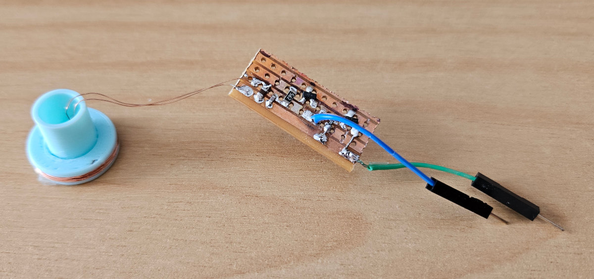
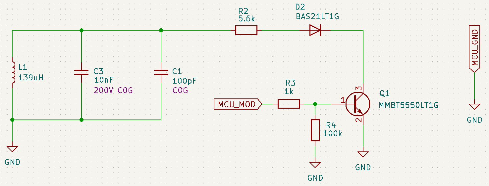
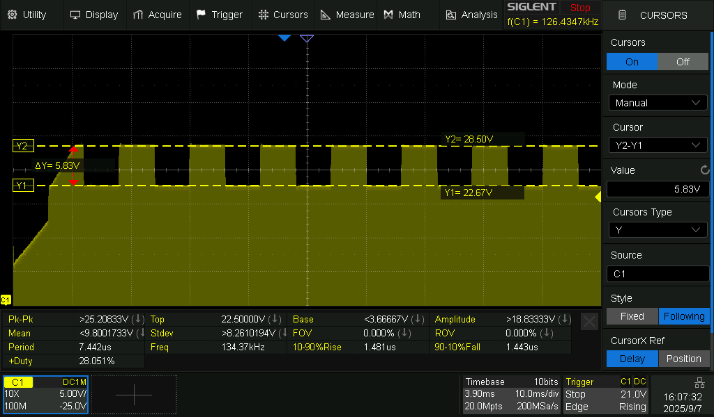
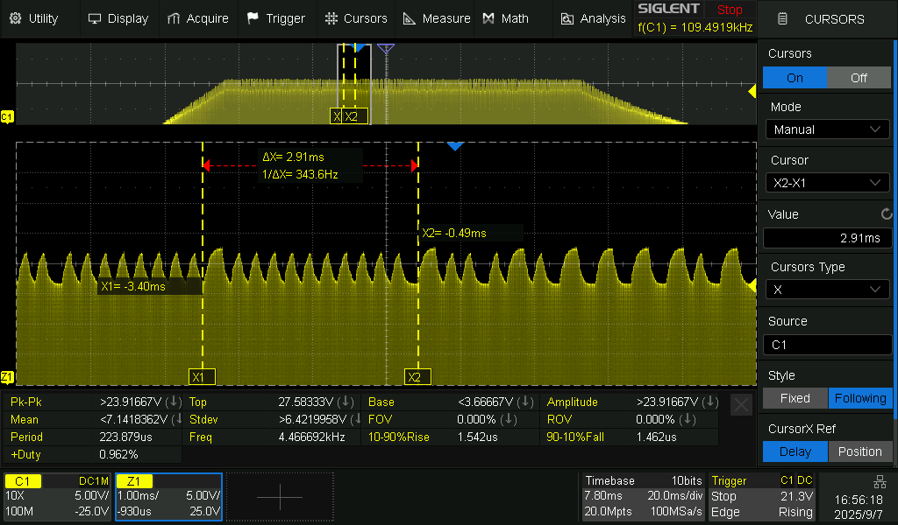

# RFID Tag Simulator for the FDX-B Protocol

The following document outlines the process of building a Tag simulator 
for use with testing an RFID reader on the 134.2kHz FDX-B Protocol.  It allows you to
fine tune a RFID reader's protocol decoding at extended ranges through
mapping of the Tag's and Readers signals.

It can also be used to transmit any FDX-B telegram and ID information contained within
such as done with RFID Cloning.





## Tag Schematic



The above schematic is for the simulated Tag where `MCU_MOD` is the PWM signal generated by a Microcontroller for
the 128 bit FDX-B telegram and `MCU_GND` is ground connection to the Microcontroller.

All components must be rated to handle the ~30V voltage range induced in the circuit.   


## Coil

In the schematic we have a 139uH coil `L1`.   This is wound from 0.2mm enamelled copper wire on a 3D printed
bobbin of 12mm diameter and 2mm wide.

Use the [multilayer coil calculator](https://coil32.net/online-calculators/multilayer-coil-calculator.html) to
work out the coil winding for the target inductance.    We initially targeted a 220uH coil of specification:

| Specification | Value  |
|---------------|--------|
| Inductance    | 220uH  |
| Diameter      | 12mm   |
| Length        | 2mm    |
| Wire Diameter | 0.20mm |

With the following winding result

| Winding Parameters |   
|---------------------| 
| 112 turns           |
| 13 layers           |
| 5.2m copper length  |
| 2.88 ohm resistance |


However we ended up removing windings to get a 139uH coil which gave easy values for the tuning capacitors `C3` and `C1`.


### Tuning Capacitors

Once you have wound your coil you will need a good quality LCR meter to test the coils inductance at 100kHz, this value
is used for tuning capacitance of the coil to make it resonant at 134.2kHz.

Using the following formula we can calculate the resonant capacitance.

$$
C = \frac{1}{(2 \pi f)^2 L}
$$

Our coil measured exactly 139.07uH and the target FDX-B frequency is 134.2kHz, this gives;

$$
C = \frac{1}{\left(2 \pi \cdot 134.2 \times 10^{3}\right)^2 \cdot 139.07 \times 10^{-6}}
$$

$$
C = 10.11 \,\text{nF}
$$

We used a 10nF capacitor for `C3` and 100pF for `C1` to give us a total of 10.1nF which matches closely to our calculated 10.11nF.

Note: You can use any combination and number of capacitors for tuning of your coil in place of `C3` and `C1`.


## Microcontroller

You can use any Microcontroller you like to generate the PWM signal, we had a STM32G031C6 available
and used that, but you could also use an SBC with GPIO header like on an Arduino or Raspberry Pi.

The following instructions and code relate to our STM32G0, but could be adapted to other microcontrollers.


### Rmod Tuning

On the Tag schematic we need to tune the resistor `R2` which is the modulation resistance that effects how small or 
large a dip is on the envelope of the signal that defines a logic `1` and `0` of the telegram.

We have connected Tag `MCU_MOD` to pin `PA7` on the STM32 and configured it as `GPIO_Output`.

To the `Core/Src/main.c` file add the following function to generate a PWM signal that alternates every 5ms.
```
/* Hold PA7 HIGH/LOW alternately at 5 ms intervals.
   Use this to measure OFF vs ON envelope depths cleanly. */
void Run_5ms_OnOff_Test(void)
{
    // Ensure known start state
    HAL_GPIO_WritePin(MOD_GPIO_Port, MOD_Pin, GPIO_PIN_RESET); // OFF

    for (;;) {
        HAL_GPIO_WritePin(MOD_GPIO_Port, MOD_Pin, GPIO_PIN_SET);   // ON
        HAL_Delay(5);                                              // 5 ms
        HAL_GPIO_WritePin(MOD_GPIO_Port, MOD_Pin, GPIO_PIN_RESET); // OFF
        HAL_Delay(5);                                              // 5 ms
    }
}
```

Call this function from main().
```
int main(void)
{
  // NOTE: initalization code has been removed for brevity
  
  while (1)
  {
  	 Run_5ms_OnOff_Test();
  }
}
```

Place the Tag into the antenna of the RFID reader and power it on.    

Connect your oscilloscope probe to the top of coil `L1` to capture the following signal.



Use the Y-Cursors to measure the peak and trough of the signal envelope of the 5ms PWM intervals.  
Here we have `Y1=22.67V` and `Y2=28.5V`.

$$
M_{\text{depth}}(\\%) = \frac{Y2_{\text{voltage}} - Y1_{\text{voltage}}}{Y2_{\text{voltage}}}  \times 100
$$

Plug these values into the formula to calculate the modulation depth. 

$$
M_{\text{depth}}(\%) = \frac{28.5 - 22.67}{28.5} \times 100
$$

$$
M_{\text{depth}}(\%) = 20.45
$$

The target modulation depth is 20%.   If it's too high then reduce the value of `R2`.  If its too low then increase the
value of `R2`.   A range between 15-25% is sufficient.


### Telegram Generation

The FDX-B telegram data structure is 128 bits in length and defined as:

```
    msb		lsb
    0   10000000000	  Header pattern. 11 bits.
    11    1nnnnnnnn	
    20    1nnnnnnnn	  38 bit (12 digit) National code.
    29    1nnnnnnnn	  eg. 000000001008 (decimal).
    38    1nnnnnnnn	
    47    1nnnnnncc	  10 bit (3 digit) Country code.
    56    1cccccccc	  eg. 999 (decimal).
    65    1s-------	  1 bit data block status flag.
    74    1-------a	  1 bit animal application indicator.
    83    1xxxxxxxx	  16 bit checksum.
    92    1xxxxxxxx	
    101   1eeeeeeee	  24 bits of extra data if present.
    110   1eeeeeeee	  eg. $123456.
    119   1eeeeeeee	
```


Included in this repository is a python script `make-telegram.py`for generating a 128 bit telegram.

Either specify the Country and National code with parameters:
```
$ python make-telegram.py  --country 953 --national 010005888937

128 bit telegram: 10000000000110010101111111101110100110100101010101000010101110111100000000100000001110100001110000111100000000100000000100000000
Encoded ID: 953010005888937
```

Or don't pass any to generate a random telegram.
```
$ python make-telegram.py

128 bit telegram: 10000000000111010011110000011110101010111100110110000111100111000100000000100000001111101100101111000100000000100000000100000000
Encoded ID: 115143467594187
```


### Telegram Transmission


Next we need to config the STM32 to send the telegram.  

In CubeIDE/STM32CubeMX configure a Timer to run at 1 Mhz and fire every 119.25µs (ideal).   

In our case the SYSCLK was at the default 16 Mhz and we 
configured TIM2 by defining the `Prescaler` to `15` to give a 1µs tick, and the `Counter Period (ARR)` to `119`
so the Timer fires every 119µs.  `Counter Mode` was set to `Up` and enable the `TIM2 global interrupt` under `NVIC`.


Then modify the generated code in `Core/Src/main.c` and add to the appropriate sections:

```
/* Private includes ----------------------------------------------------------*/
/* USER CODE BEGIN Includes */

#include <string.h>
#include <math.h>

/* USER CODE END Includes */


/* Private variables ---------------------------------------------------------*/
/* USER CODE BEGIN PV */

TIM_HandleTypeDef htim2;

/* USER CODE END PV */


/* Private user code ---------------------------------------------------------*/
/* USER CODE BEGIN 0 */

// 134.2 kHz carrier, Manchester at 32 cycles/bit gives ~238.5 us/bit and ~119.25 us per half-bit 
#define CARRIER_HZ      134200.0f
#define HALF_BIT_US     (16000000.0f / CARRIER_HZ)   // with 1 MHz timer tick target this is ~119.25 

#define MOD_GPIO_Port   TagMod_GPIO_Port
#define MOD_Pin         TagMod_Pin

// Your FDX-B telegram
static const char *fdxb_bits =
"10000000000110010101111111101110100110100101010101000010101110111100000000100000001110100001110000111100000000100000000100000000";


// Buffer for half-bit output levels (0/1). DBP doubles length. 
#define MAX_BITS        512
static uint8_t dbp_halves[MAX_BITS*2];
static uint32_t dbp_len = 0;
static volatile uint32_t dbp_idx = 0;


/* ---------- Differential Bi-phase (DBP) builder ----------
   Rule: mid-bit transition ALWAYS; start-of-bit transition ONLY for bit '0'.
   We generate absolute output levels for each half-bit.
   phase_init = 0, first half-bit is "OFF" (no load) unless the first bit is '0'.
*/
static void build_dbp_halves(const char *bits, uint8_t phase_init)
{
    dbp_len = 0;
    uint8_t phase = phase_init;              // current output level (0=OFF, 1=ON)
    size_t n = strlen(bits);
    if (n > MAX_BITS) n = MAX_BITS;

    for (size_t i = 0; i < n; ++i) {
        char b = bits[i];

        // Start-of-bit transition for '0' 
        if (b == '0') {
            phase ^= 1;
        }
        // First half-bit level 
        dbp_halves[dbp_len++] = phase;

        // Mandatory mid-bit transition 
        phase ^= 1;

        // Second half-bit level 
        dbp_halves[dbp_len++] = phase;
    }
}

/* Start TIM2 periodic interrupt for half-bits (~119 us) */
static void start_halfbit_timer(void)
{
    HAL_TIM_Base_Start_IT(&htim2);
}

/* TIM2 ISR: push next half-bit level to PA7 */
void HAL_TIM_PeriodElapsedCallback(TIM_HandleTypeDef *htim)
{
    if (htim->Instance == TIM2) {
        uint8_t level = dbp_halves[dbp_idx++];
        if (dbp_idx >= dbp_len) dbp_idx = 0;  // loop telegram
        if (level) {
            MOD_GPIO_Port->BSRR = MOD_Pin;   // drive ON (add loss)
        } else {
            MOD_GPIO_Port->BRR  = MOD_Pin;   // drive OFF
        }
    }
}

/* USER CODE END 0 */
```

Then modify the main loop to continuously transmit the telegram.
```
int main(void)
{

  // NOTE: initalization code has been removed for brevity
  
  /* USER CODE BEGIN 2 */
  
  // Build DBP sequence. Set phase_init=0 for idle low (no load).
  build_dbp_halves(fdxb_bits, /*phase_init=*/0);
  start_halfbit_timer();

  /* USER CODE END 2 */

  /* Infinite loop */
  /* USER CODE BEGIN WHILE */
  while (1)
  {
    /* USER CODE END WHILE */


    /* USER CODE BEGIN 3 */
	//Run_5ms_OnOff_Test();
  }
  /* USER CODE END 3 */
}
```


Place your Tag in the RFID readers antenna and capture the signal with oscilloscope
as done before when tuning the Rmod resistor value.



In the screenshot above the transmitted telegram can be seen.  Between the X-Cursors
the FDX-B header `10000000000` is displayed.

